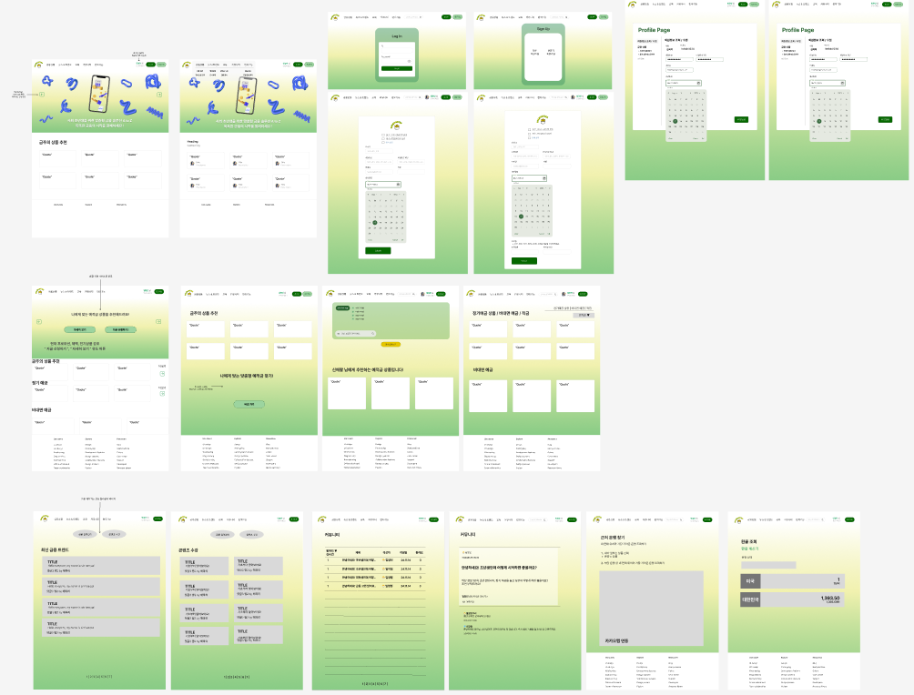

# Project1. Visualization
[프로젝트1 - 자세히 보기](/Project1_visualization/README.md)
## 1. 프로젝트명
아동학대 현황 분석 및 아동학대 발생률 감소를 위한 노력

## 2. 프로젝트 선정 배경
미디어에서 아동학대와 관련된 소식이 끊이지 않고 있어 아이들의 인권 보호가 절실히 필요한 시점이라고 생각되어 주제로 선정하게 되었습니다.

## 3. 수행방법 및 일정
|구분|기간|활동|
|-|-|-|
|사전 기획|8/1 - 8/2|프로젝트 기획 및 주제 선정|
|데이터 선정|8/3 - 8/4|데이터 수집 및 정제|
|시각화|8/7 - 8/11|데이터 시각화|
|데이터 분석|8/14 - 8/15|시각화 기반 데이터 분석|
|포트폴리오 작성|8/16|포트폴리오 작성|
|프로젝트 발표|8/17|프로젝트 발표|

## 4. 프로젝트 개요
### 아동학대란?
보호자를 포함한 성인이 1818세 미만의 미성년자 아이들의 건강이나 복지를 해하거나 제대로 된 성장발달을
못하도록 성적, 신체적 또는 정신적 폭력과 가혹행위가 있을 경우나 자식을 유기하거나 방임하는 경우 (아동복지법 제33조 제77호)

### 아동학대 의심신호
**아래의 내용 중 "한 가지 경우"만 해당되어도 아동학대 의심 신고 가능**  

**<신체적 학대>**
- 사고로 보기에 미심쩍은 상처, 흔적
- 발생, 회복에 시간 차이가 있는 상처나 골절
- 신체 상흔으로 자주 병원을 가는 경우
- 사용된 도구의 모양이 그대로 나타나는 상처

**<정서적 학대>**
- 수면 이상
- 비행, 퇴행 등의 문제 행동
- 신체적 원인이 없는 잦은 통증, 여러 증상의 호소
- 자해 또는 자살 시도

**<성적 학대>**
- 걷거나 앉는 것을 어려워함
- 성기 부위의 통증이나 가려움
- 성기 또는 회음부 손상, 상처
- 성병, 임신

**<방임>**
- 성장지연
- 영양실조, 적절하지 않은 영양 섭취
- 계절에 맞지 않는 옷, 위생관리가 되지 않은 상태
- 지속적인 피로의 호소

# Project2. EggMoneyNa
[프로젝트2 - 자세히 보기](/Project2_EggMoneyNa/README.md)

[1. 팀원 정보 및 업무 분담](#i-팀원-정보-및-업무-분담-내역)  
[2. 설계 내용 및 실제 구현 정도](#ii-설계-내용아키텍처-등-및-실제-구현-정도)  

## I. 팀원 정보 및 업무 분담 내역

- 신해인  
  - **Front-End**  

| **language** | **framework** | **기능 구현** |
| --- | --- | --- |
| JavaScript | Vue3 | 커뮤니티 CRUD 기능 프론트 구현 |
| - | axios | 금융 용어 챗봇 데이터 통신 구현 | 
| - | | 유튜브 API를 활용한 금융 관련 영상 제공 |
| - | HTML / CSS | 금융 상품 비교 기능의 시각화 구현 |
| - | | 전반적인 페이지 디자인 및 사용자 친화적인 레이아웃 설계 |

- 임정인  
  - **Back-End**  

| **language** | **framework** | **기능 구현** |
| --- | --- | --- |
| Python | Django | 사용자 커스터마이징 및 DB 모델링  |
| - | Django-Rest-Framework | 금융상품 추천 알고리즘 구현 및 API 설계  |
| - | dj-rest-auth | 커뮤니티 기능(게시글, 댓글)을 위한 CRUD 및 인증 시스템 구현 |
| - | | 데이터베이스 설계, 구축, 최적화 및 전반적인 관리 |

## II. 설계 내용(아키텍처 등) 및 실제 구현 정도
### 구현 기능 설명

1. **메인 페이지**
   - 캐러셀 사용
   - 금주의 추천 상품 등록

2. **회원 커스터마이징**
   - 회원가입(일반 / 전문가), 로그인, 로그아웃
   - 아이디, 비밀번호, 이름, 이메일, 성별, 소득수준, 자격증 종류, 취득일자, 자격증 번호

3. **예적금 금리 비교**
   - 정기 예금 / 정기 적금
   - 은행 이름 별, 예치 기간 별 필터링 검색 가능
   - 개월 수 별로 오름차순 내림차순으로 금리에 따라 정렬 가능
   - 클릭 시 상세 정보 조회 가능
     - 개월 수 별로 평균 금리, 저축 금리, 최고 우대 금리 조회 가능, 가입 및 해지 가능

4. **환율 계산기**
   - 원화뿐만 아니라 통화 별로 환율 검색 가능

5. **근처 은행 검색**
   - 시 군 구 별로 검색 가능, 현 위치에서 검색 가능

6. **커뮤니티**
   - 소통 및 질의응답 가능 (전문가 회원 有)
   - 닉네임에 마크 표시, 일반 및 전문가 회원 구분 가능
   - 회원 본인만 게시글 수정 삭제, 댓글 수정 삭제 가능
   - 로그인하지 않으면 접근 불가능

7. **프로필 페이지**
   - nav bar에서 이름 클릭 시, 프로필 페이지로 이동
   - 이름, 아이디 고정값, 비밀번호, 이메일, 생년월일, 성별, 소득수준 변경 가능
   - 가입한 상품 보기 - 금융 상품 디테일 모달에서 가입한 상품들 조회 가능
   - 금융 성향 테스트 - 6가지 질문에 각 4개의 선택지의 테스트로 금융 성향 테스트 가능
   - 추천 상품 보기 
     - 나이 + 소득 + 투자 성향 합산한 세 가지 점수를 통해서 최종적으로 네 가지 성향을 구분 
       => 구분한 성향에 따른 추천 상품 분류
     - 예금 및 적금 상품 추천 받을 수 있음
   - 회원탈퇴 기능

8. **금융 상품 추천 알고리즘**

9. **생성형 AI 활용**

10. **라이브러리 기능**
    - 유튜브 및 알라딘 API 사용
    - 금융 초보에게 알맞은 콘텐츠와 도서 추천 

<h3>Figma  
    

▶️ [Figma-Link](https://www.figma.com/design/ubUUGmkQ1ZScLdoiwwKU7M/SSAFY-1%ED%95%99%EA%B8%B0-%EA%B4%80%ED%86%B5%ED%94%84%EB%A1%9C%EC%A0%9D%ED%8A%B8?node-id=0-1&node-type=canvas&t=gjHbt71JViXdOFWv-0)

